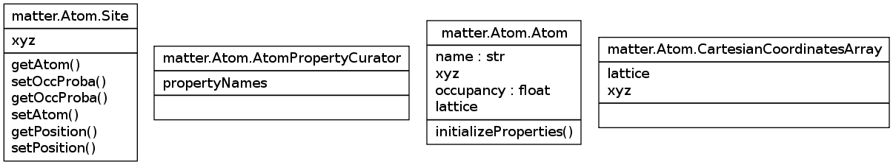

Tutorial
========

Overview
--------

Pyrev generates class and component diagrams in all formats that graphviz/dot knows:

canon cmap cmapx cmapx_np dia dot eps fig gd gd2 gif hpgl imap imap_np ismap jpe jpeg jpg mif mp pcl pdf pic plain plain-ext png ps ps2 svg svgz tk vml vmlz vrml vtx wbmp xdot xlib

and also in VCG.  Here is an example using the png output format:

$ python pyrev.py -o png -p Atom matter.Atom
[...]
creating diagram classes_Atom.png

It uses these options:

 * -o :  sets the output format

 * -p name : yields the output files packages_name.png and classes_name.png

In general, one can modify output with following options:

 -a N, -A    depth of research for ancestors
 -s N, -S    depth of research for associated classes
 -A, -S      all ancestors, resp. all associated
 -m[yn]      add or remove the module name
 -f MOD      filter the attributes : PUB_ONLY/SPECIAL/OTHER/ALL
 -k          show only the classes (no attributes and methods)
 -b          show 'builtin' objects

Examples
--------

General vue on a module
^^^^^^^^^^^^^^^^^^^^^^^

$ python pyrev.py -ASmy -k -o png matter.Structure -p Structure

.. image:: classes_Structure.png

With these options you can have a quick vue of the dependencies without being lost in endless lists of methods and attributes.

Detailed vue on a module
^^^^^^^^^^^^^^^^^^^^^^^^

$ python pyrev.py -c -f ALL -o png  matter.Structure -p StructureDetailed

.. image:: classes_StructureDetailed.png

Show all methods and attributes of the class (-f ALL).
By default, the class diagram option -c uses the options
-A, -S, -my, but here we deactivate them
to get a reasonably small image.

Configuration File
^^^^^^^^^^^^^^^^^^

You can put some options into the file ".pyrevrc" in your home directory.

Example:

--filter-mode=PUB_ONLY --ignore doc --ignore test

This will exclude documentation and test files in the doc and test
directories. Also, we will see only "public" methods.
 