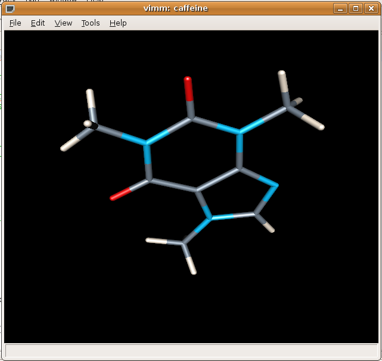
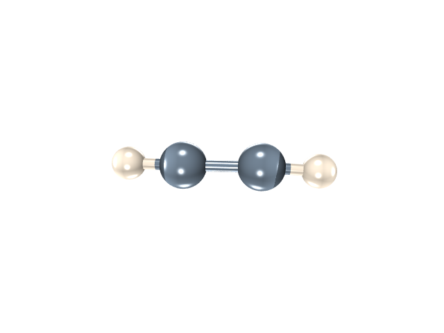
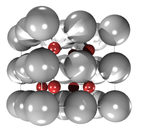
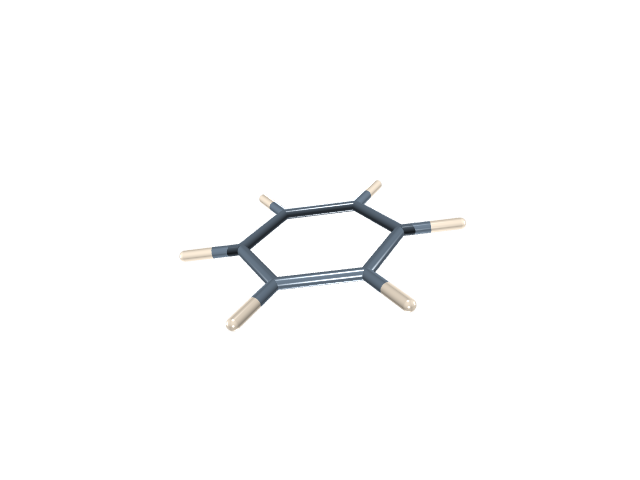
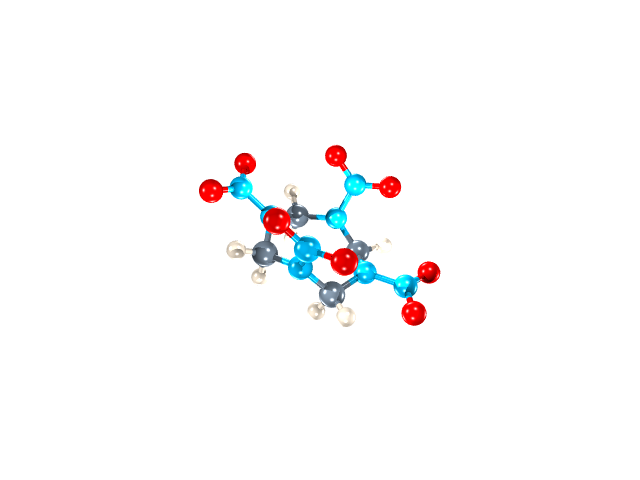
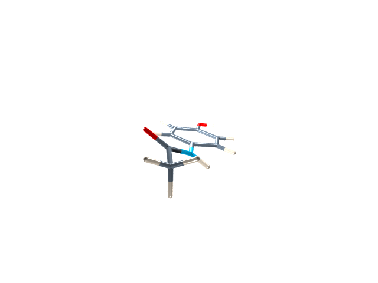

General Information
===================

What is Vimm?
-------------

VIMM is the Visual Interface for Materials Manipulation, and has two parts: a wx graphical front-end in Luban based on pyopengl, and a javascript graphical front-end for Luban based on o3d. Vimm will provide tools to visualize molecules and materials, perform simple
manipulations of the structures, and input/output the structures to/from a variety of different file formats or pass the altered structures to other applications, such as physics engines. 

Wx Screenshot:

Web Screenshot:

(coming)

What can Vimm do?
-----------------

 * visualize the structures of molecules and materials using a number of different conventions (lines, ball-and-stick, balls,
cylinders)

 * animate phonon modes.

 * animate the structures in files that have multiple geometries, e.g. from a geometry optimization, molecular dynamics, or Monte Carlo.

 * take screenshots of either single frames or all of the frames in a movie.

 * perform simple analysis such as measuring distances between atoms

 * build simple crystals, and do simple modifications of existing crystals such as building supercells and slabs.
 
 * build nanotubes, build alkanes, and view electronic structure orbitals.

Who is to credit/blame for Vimm?
--------------------------------

J. Brandon Keith wrote it at Caltech.  It was inspired by Vimes from Sandia National
Laboratories which owned the copyright in 2005. 

Installation
============

What are the requirements to run Vimm?
--------------------------------------

  * `python <http://python.org>`_
  * `wxPython widgets <http://wxpython.org>`_
  * `numpy <http://numpy.org>`_
  * `pyopengl <http://pyopengl.sf.net>`_ Note: be careful of installing PyOpenGL directly from it's website rather than, say, a linux distribution package (especially with OpenGLContext and/or PyOpenGLAccelerations)...using all these within the Eclipse the IDE has been known to produce severe memory leaks which are still under investigation.

How do I install/run Vimm?
--------------------------

First make sure the above requirements are met (see above).
Now download/unpack the tarball into some directory that we'll call
$(VIMM_HOME). 
Type 

$ python $(VIMM_HOME)/Vimm/runVimm.py

to run Vimm, where $(VIMM_HOME) should be replaced with whatever
directory you put Vimm into. On OS X you will need to type 'pythonw'
instead of 'python'. 

People familiar with Python may note the setup.py file in the $(VIMM_HOME) directory and assume that they can install the library using the python distutils.
Although that route has certain advantages, we prefer to install and
run Vimm in a local directory for the time being.
The setup.py file is present simply to aid building and
maintenance of the release tarballs.

You might want to test Vimm by running some of the example files in
the $(VIMM_HOME)/testfiles directory. Note that not all of the
structures are currently supported. But you're safe loading the files
ending in xyz, bgf, or pdb.

How to use Vimm as a library
============================

VimmLib allows much of the functionality of Vimm to be accessed
from the Python command line. Graphical interfaces are nice, but
there are times when they are slow or otherwise inconvenient.
VimmLib allows you to circumvent this.

As a teaser for what VimmLib can do, consider the following. See the
above note about setting up your $PYTHONPATH variable if you're
interested in trying to reproduce this::

	from vimmLib import *
	rdx_444 = load_file('rdx_444.bgf')
	rdx_888 = build_supercell(rdx_444,2,2,2)
	save_file('rdx_888.bgf',rdx_888)

This example loads a 30,000 atom BGF file containing the structure of
the 4x4x4 supercell of the explosive RDX, takes the 2x2x2 supercell
of that structure (making an 8x8x8 supercell), and then saves this
structure to another file.

Roadmap
=======

Phase 1: Create builders in o3d and pyopengl/wx
Phase 2: Fold these into Luban
Phase 3: Add additional features:
 * General lattice symmetries
 * Fermi surface plotting
 * Phonon vibrations
 * simultaneous simulation?

Beyond DANSE:
* coarse-grained represenations from chimera
* structure manipulations from nanoengineer

Also see:
pizza.py
FreeCad
MGL Tools or mayavi for efficient volume rendering techniques?
pymol

 

Gallery
=======

acetylene

AlNi222

benzene

rdx

tylenol

